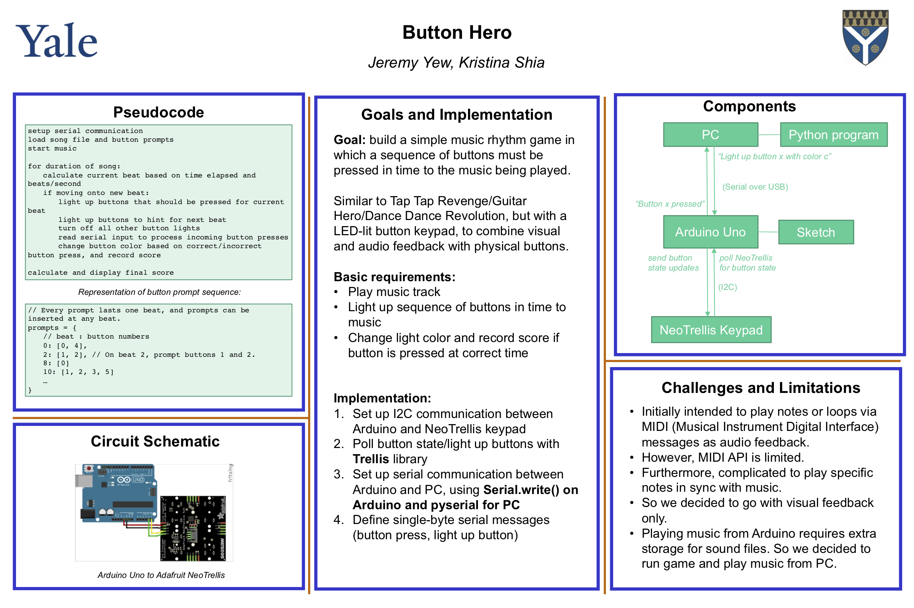

# beatbox-cpsc338
A highly addictive rhythm game with very aesthetic and squishable buttons. Hit the buttons as they light up in time to the music! 

## Demo 
TODO.

## Game instructions
Press the buttons in beat to the music. Some patterns will repeat but get more complicated as the song progresses. 

- When a button turns **dark blue**, it's hinting that it's about to turn active in the next beat. 
- When a button turns **light blue**, it's active, so hit that button within that beat to score a point. 
  - If you pressed it in time, it will turn **purple**.
    Too early or too late and it will turn **red**, and you lose a point. 

Your final score will be printed on the screen. Have fun!

## Setup and play 
Connect Beatbox and laptop via USB. 
Run `python game.py <song_name>`, e.g. `python game.py firefly`. 

Songs included: 
- `firefly`: Fireflies by Owl City (Difficulty: Easy)
- `sucker`: Sucker by Jonas Brothers (Difficulty: Medium)
- `nobody`: Nobody by James Arthur, Martin Jensen (Difficulty: Hard)
- `shape_of_you`: Shape of You by Ed Sheeran, Galantis Remix (Difficulty: Hard)


# Highlights 
## Message system between CPU and Arduino 
We send single-byte messages over serial communication, so that we don't have to define a custom multiple-bytes protocol. That means we can encode the numbers `0-256`.

### Arduino to CPU
We have 16 buttons, and 2 possible message (`PRESSED`, `RELEASED`) for the Arduino to send to the PC that correspond to 2 different button states. So we only use `0-31`. 

For `CORRECT` or `WRONG` feedback, we only light up while the button is pressed, instead of for a duration, that's why we register button releases as well.  

- `0-15`: button `N` has been `PRESSED`.
- `16-31`: button `N` has been `RELEASED`.


### CPU to Arduino 
The CPU either:
-  tells the Arduino to light up (`HINT`, `ACTIVE`) and turn off (`OFF`) buttons on the keypad at specific beats. 
-  receives messages from the Arduino that a button has been pressed, checks whether it was pressed in the correct time window, and then sends the feedback `CORRECT` or `WRONG` for the button to light up.

We have 16 buttons, and 5 possible actions (`OFF`, `WRONG`, `ACTIVE`,`HINT`, and `CORRECT`) for the PC to send to the Arduino that correspond to 5 different button LED states, so we'll have 5 ranges of size 16, and `5 x 16 = 80`. So we only use `0-79`. 

- `0-15`: set button `N` to `OFF` (no light).
- `16-31`: set button `N` to `WRONG` (red). 
- `32-47`: set button `N` to `ACTIVE` (bright blue).
- `48-63`: set button `N` to `HINT` (dark blue).
- `64-79`: set button `N` to `CORRECT` (purple).
## Composing new song sequences 
### Manual composing: sequence notation
Every prompt lasts one beat, and prompts can be inserted at any beat.
```
prompts = {
   // beat : button numbers
   0: [0, 4],
   2: [1, 2], // On beat 2, prompt buttons 1 and 2.
   8: [0]
   10: [1, 2, 3, 5]
   ...
}
```

### Auto-compose: write new sequences by playing them out 
TODO.

# Development 
## Goals 
Build a simple music rhythm game in which a sequence of buttons must be pressed in time to the music being played. Similar to Tap Tap Revenge/Guitar Hero/Dance Dance Revolution, but with a LED-lit button keypad, to combine visual and audio feedback with physical buttons.

## Basic requirements:
- Play music track
- Light up sequence of buttons in time to music
- Change light color and record score if button is pressed at correct time

## Implementation
1. Set up I2C communication between Arduino and NeoTrellis keypad. 
2. Arduino polls button state and lights up buttons on keypad with Trellis library.
3. Set up serial communication between Arduino and PC, using `Serial.write()` on Arduino and `pyserial` for PC.
4. Define single-byte serial messages (light up button, button pressed). 
5. PC runs game driver code, telling the Arduino which buttons to light up, while Arduino tells PC when buttons are pressed. 
6. Driver code processes data object to play notes in time to music.

## Game driver pseudocode
```
setup serial communication
load song file and button prompts
start music
for duration of song:
   calculate current beat based on time elapsed and beats/second
   if moving onto new beat:
       light up buttons that should be pressed for current beat
       light up buttons to hint for next beat
       turn off all other button lights
       read serial input to process incoming button presses
       change button color based on correct/incorrect button press, and record score
calculate and display final score
```

## Information poster 


## Circuit Schematic


## Bill of materials
- Adafruit NeoTrellis RGB Driver PCB for 4x4 Keypad (RGB LEDs included) https://www.adafruit.com/product/3954 
- Silicone Elastomer 4x4 Button Keypad for 3mm LEDs https://www.adafruit.com/product/1611
- USB 2.0 CABLE TYPE A/B https://store.arduino.cc/usa/usb-2-0-cable-type-a-b

## References 
- Connect NeoTrellis to arduino: https://learn.adafruit.com/adafruit-neotrellis 